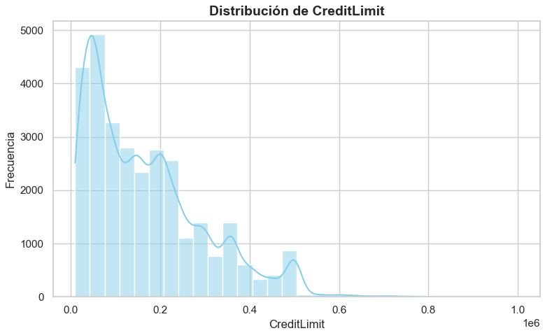
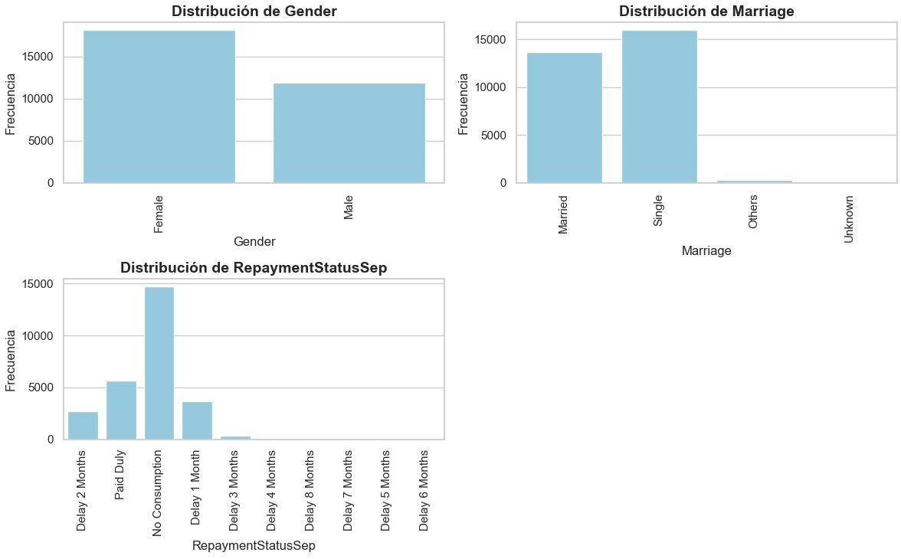
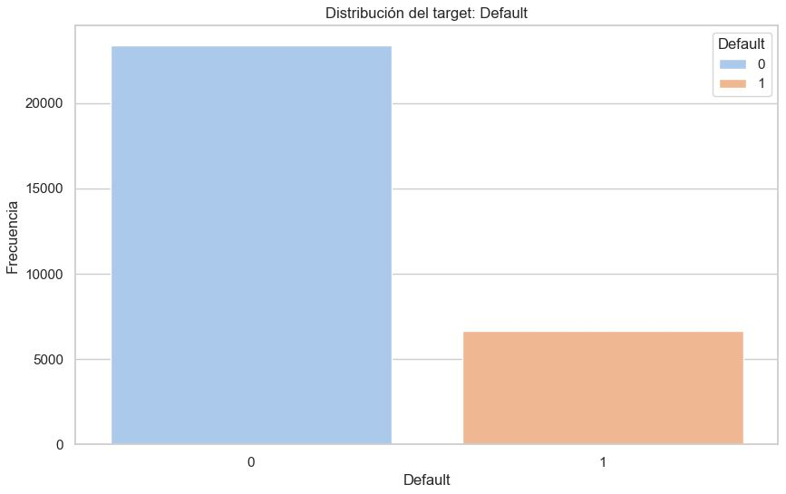
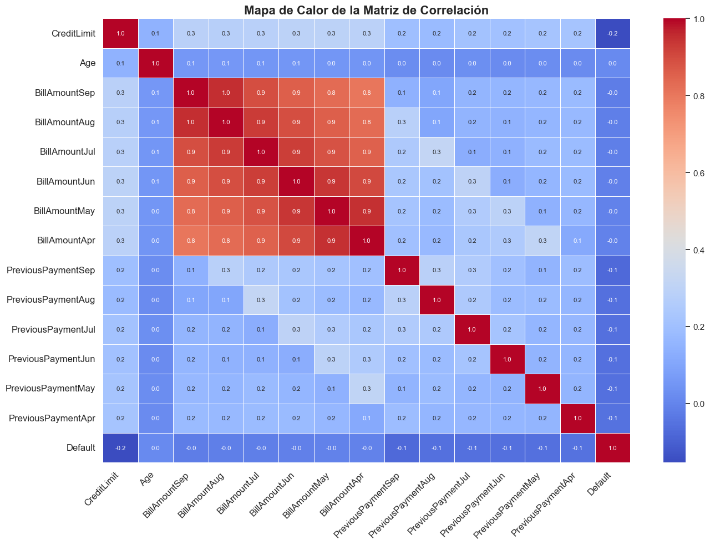
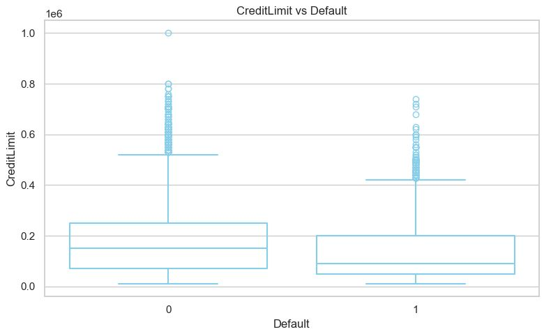
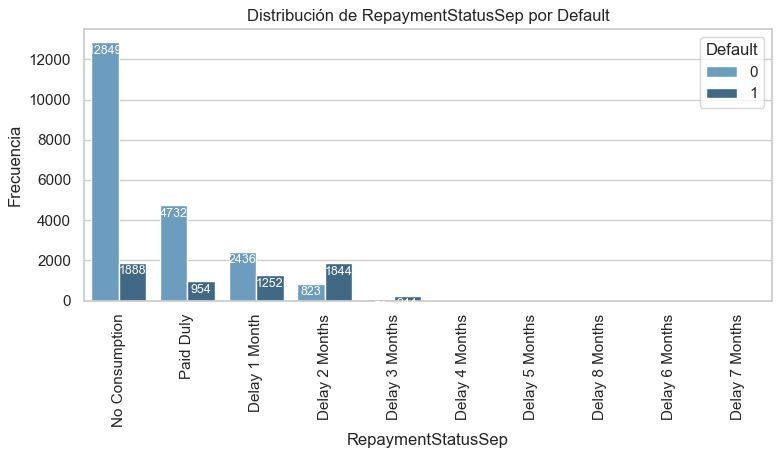

EDA
===

.. automodule:: EDA
   :members:
   :undoc-members:
   :show-inheritance:

Example
~~~~~~~

>>> from EDA import EDAProcessor
>>> eda = EDAProcessor(
>>>   target=target,
>>>   ordinal_columns=["EducationLevel"],
>>>   exclude_columns=["Id"]
>>> )

>>> eda.run(df)
Empezando EDA...
EDA completado ...

>>> eda.distribution_variable(df, "Age", n_bins=10)
Age
[21, 26)    3871
[26, 32)    8359
[32, 38)    6728
[38, 44)    5056
[44, 50)    3306
[50, 56)    1836
[56, 62)     628
[62, 68)     171
[68, 74)      40
[74, 80)       5
Name: count, dtype: int64

>>> eda.plot_numerical_variables(df, num_vars=["CreditLimit"])

>>> eda.plot_categorical_variables(df, cat_vars=["Gender", "Marriage", "RepaymentStatusSep"])

>>> eda.plot_target(df)

>>> eda.plot_correlations()

>>> eda.plot_numerical_vs_target(df, num_vars=["CreditLimit"])

>>> eda.plot_histogram_vs_target(df, cat_vars=["RepaymentStatusSep"])

>>> results = eda.get_results()
>>> results

==================  ===========  ===========  ===========  ==========  ==============
..                  dtype          n_missing    p_missing    n_unique    is_duplicate
==================  ===========  ===========  ===========  ==========  ==============
Id                  numerical              0    0               30000               0
CreditLimit         numerical              0    0                  81               0
Gender              categorical            0    0                   2               0
EducationLevel      ordinal               14    0.0466667           5               0
Marriage            categorical            0    0                   4               0
Age                 numerical              0    0                  56               0
RepaymentStatusSep  categorical         2759    9.19667            10               0
RepaymentStatusAug  categorical         3782   12.6067             10               0
RepaymentStatusJul  categorical         4085   13.6167             10               0
RepaymentStatusJun  categorical         4348   14.4933             10               0
RepaymentStatusMay  categorical         4546   15.1533              9               0
RepaymentStatusApr  categorical         4895   16.3167              9               0
BillAmountSep       numerical              0    0               22723               0
BillAmountAug       numerical              0    0               22346               0
BillAmountJul       numerical              0    0               22026               0
BillAmountJun       numerical              0    0               21548               0
BillAmountMay       numerical              0    0               21010               0
BillAmountApr       numerical              0    0               20604               0
PreviousPaymentSep  numerical              0    0                7943               0
PreviousPaymentAug  numerical              0    0                7899               0
PreviousPaymentJul  numerical              0    0                7518               0
PreviousPaymentJun  numerical              0    0                6937               0
PreviousPaymentMay  numerical              0    0                6897               0
PreviousPaymentApr  numerical              0    0                6939               0
Default             target                 0    0                   2               0
==================  ===========  ===========  ===========  ==========  ==============

Notebook
~~~~~~~~

.. nbgallery::

   notebooks/1-EDA.ipynb

